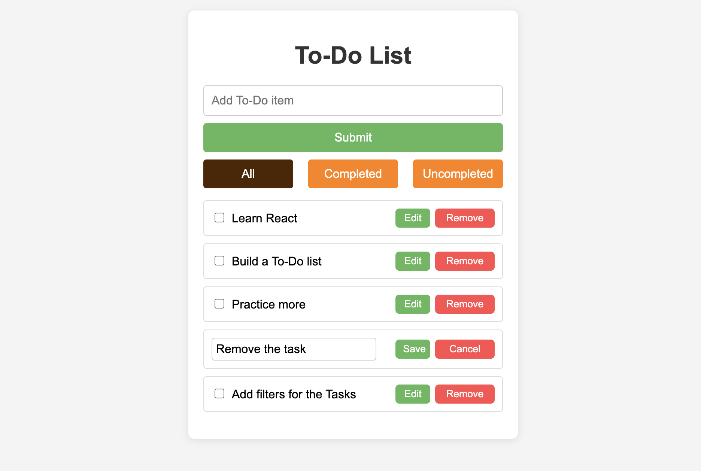

# To-Do List Application

A simple, interactive To-Do List application built using React. This project allows users to add, mark, filter, edit, and remove tasks. It is designed as a beginner-friendly project to learn React basics like state management, event handling, and conditional rendering.

## Features

- **Add Tasks**: Users can add new tasks by entering text in the input field and clicking the "Submit" button.
- **Mark Tasks as Completed**: Users can mark tasks as completed using the checkbox next to each task.
- **Remove Tasks**: Each task has a "Remove" button to delete it from the list.
- **Filter Tasks**: Filter tasks by "All", "Completed", or "Uncompleted" using the filter buttons.
- **Edit Tasks**: Users can edit an existing task by clicking the "Edit" button, modifying the text, and saving the changes.

## Technologies Used

- **React**: JavaScript library for building user interfaces.
- **CSS**: Styling for the application.

## Getting Started

Follow these instructions to get a copy of the project up and running on your local machine for development and testing purposes.

### Prerequisites

- **Node.js** and **npm**: Make sure you have [Node.js](https://nodejs.org/) and npm installed on your system.

### Installation

1. **Clone the Repository**
   ```bash
   git clone https://github.com/nikhil-dey/React-TODO-List.git
   ```

2. **Navigate to the Project Directory**
   ```bash
   cd React-TODO-List
   ```

3. **Install Dependencies**
   ```bash
   npm install
   ```

4. **Start the Development Server**
   ```bash
   npm run dev
   ```
   The application will open in your browser at `http://localhost:3000`.

## Usage

- Enter a task in the input field and click "Submit" to add it to the list.
- Use the checkbox to mark a task as completed.
- Click the "Remove" button to delete a task.
- Use the filter buttons to display "All", "Completed", or "Uncompleted" tasks.
- Click the "Edit" button to modify an existing task, then click "Save" to save changes or "Cancel" to discard them.

## File Structure

- **App.js**: The main component containing the logic for adding, removing, editing, and filtering tasks.
- **App.css**: Styles for the application, including layout, buttons, and task list items.

## Customization

- You can easily customize the styles in the `App.css` file to match your design preferences.
- Additional features such as task due dates, priority levels, or persistent storage could be added to extend the functionality.

## Screenshots



## Learning Outcomes

- Understanding React state (`useState`) and effect (`useEffect`) hooks.
- Conditional rendering and dynamic updates in React.
- Basic use of JavaScript ES6 features such as arrow functions, destructuring, and spread operator.

## Contributing

Contributions are welcome! Feel free to open an issue or submit a pull request.

1. Fork the repository.
2. Create your feature branch:
   ```bash
   git checkout -b feature/YourFeature
   ```
3. Commit your changes:
   ```bash
   git commit -m 'Add some feature'
   ```
4. Push to the branch:
   ```bash
   git push origin feature/YourFeature
   ```
5. Open a pull request.

## Contact

If you have any questions, feel free to reach out:
- GitHub: [@nikhil-dey](https://github.com/nikhil-dey)
- Email: [your-email@example.com](mailto:your-email@example.com)